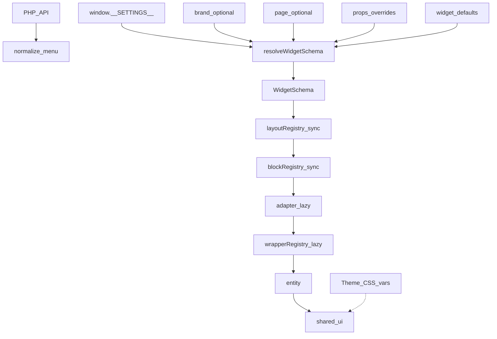

# Widgets — Schema Driven UI

Data boundary: **untrusted init/settings → DTO → domain → schema → UI**.

## Platform pipeline



## Separation

| Source                                      | Owns                                               |
| ------------------------------------------- | -------------------------------------------------- |
| Theme (`src/assets/theme/**`)               | colors, spacing, radius, fonts, sizes              |
| Settings (`window.__SETTINGS__`)            | behavior, layout, variants, wrappers, capabilities |
| API                                         | menu / content data                                |
| Schema (`shared/schema` + `resolve*Schema`) | merged contract passed as props                    |

## Shared schema core

- [`src/shared/schema/`](../shared/schema/) — `resolveWidgetSchema`, `mergeSchemaLayers`, capabilities helpers
- Inheritance: `defaults → global → brand → page → props` (brand/page optional)
- Wrappers: [`src/shared/ui/overlay/`](../shared/ui/overlay/) — `WRAPPER_REGISTRY` (lazy by mode)

## Header (reference)

```txt
useAppLayout → resolveHeaderSchema → AppHeader(menu, config/schema)
  → typePack Strategy (sync)
  → layoutRegistry (sync)
  → blockRegistry (sync)
  → plugin adapters (lazy) + wrapperRegistry
```

**Current migration state**

| Layer                                            | Status               |
| ------------------------------------------------ | -------------------- |
| `shared/schema` + overlay wrappers               | shipped              |
| `resolveHeaderSchema` / HeaderSchema fields      | shipped              |
| `ui/type` (layout strategy packs)                | active               |
| Block `adapters.ts` + `shared/lib/widgetAdapter` | wallet/search seeded |
| Full Header Engine v4 (`engine/` singleton)      | deferred (optional)  |

Blocks must not call `getSettings()` — only resolved schema via props/context.

## Sidebar / banner / footer

Same contract: `resolve*Schema` in app layout, widgets receive `menu`/`content` + `schema` only.

**Sidebar migration state**

| Layer                                            | Status              |
| ------------------------------------------------ | ------------------- |
| `resolveSidebarSchema` + typePack shell          | shipped             |
| Block `adapters.ts` + `shared/lib/widgetAdapter` | search/promo seeded |
| `blockVariants` (derive from `type` when omit)   | shipped             |
| Full engine singleton                            | deferred (optional) |

**Type pack flow:** `config.type` → `resolveSidebarTypePack` → `Root` provides pack via context. Pack owns **per-type** `Strategy` (full chrome tree), `Item` / chrome links, optional `blocks` overlay. `ui/Block` applies `typePack.blocks` over `BLOCK_REGISTRY`. See `ui/type/README.md`.

## SCSS

See `.cursor/rules/header-scss-guard.mdc` — tokens and paint only; no layout logic in CSS.
