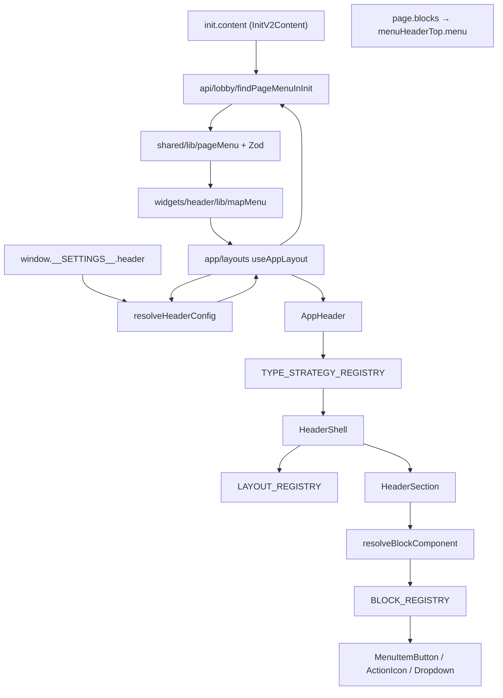

# Header widget — runtime architecture

Phase 0–1 scaffold. Data boundary: **untrusted init/settings → DTO → domain → UI**.

## Pipeline



## Layer responsibilities

| Layer             | Path                                                        | Role                            |
| ----------------- | ----------------------------------------------------------- | ------------------------------- |
| API boundary      | `shared/schemas/pageMenu.schema.ts`, `shared/lib/pageMenu/` | coerce `unknown` + Zod          |
| Init lookup       | `api/lobby/findPageMenuInInit.ts`                           | `page.menu` by key              |
| App orchestration | `app/layouts/lib/extract*FromInit.ts`                       | parse + map → `HeaderMenuModel` |
| Config            | `widgets/header/config/resolve.ts`                          | settings → `HeaderConfig`       |
| Type strategy     | `widgets/header/ui/type/*`                                  | default vs custom block merge   |
| Layout            | `registry/layouts.ts`                                       | container / container-fluid     |
| Block routing     | `registry/blocks.ts`, `registry/keys.ts`                    | strict registry keys            |
| Menu UI           | `ui/menu/*`, `ui/blocks/*`                                  | presentation only               |

## Data types

```txt
unknown (PHP)
  → PageMenuItemDto / PageMenuRootDto (validated)
  → HeaderMenuItem / HeaderMenuModel (domain)
  → HeaderBlockProps.item (UI)
```

## Registry keys (strict)

```txt
default | menuDropdown | search | logo | wallet | notification | bonus_box
```

API menu keys like `profile` → `default` block.

## SCSS

See `.cursor/rules/header-scss-guard.mdc` — tokens and paint only; no layout logic in CSS.

## Phase 2 (not implemented)

- plugins + lazy adapters for special blocks
- `engine/`, `runtime/`, `sdk/` per Header Engine v4
